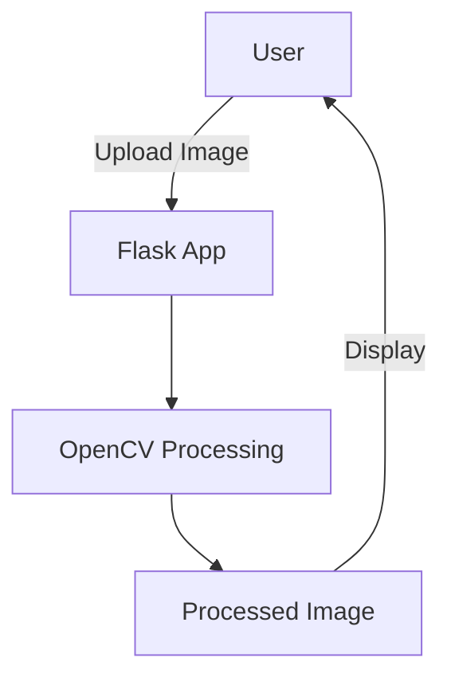

# FitVision: AI-Powered Virtual Wardrobe


**FitVision** is an open-source AI app that lets users **virtually try on clothes** by uploading a photo of the clothing item. The app generates a realistic image of the user wearing the item, helping them visualize fit and style.

## Features
- **Image Upload**: Upload a photo of clothing to virtually try it on.
- **Background Removal**: Basic image processing to remove backgrounds.
- **Self-Hosted**: Run locally or on a VPS for privacy and control.
- **Extensible**: Modular design for community contributions.

## Technical Architecture



1. **Frontend**: Flask + Bootstrap for a responsive UI.
2. **Backend**: Python + OpenCV for image processing.
3. **Storage**: Local filesystem for uploaded images.
4. **Future Work**: Integrate **Segment Anything Model (SAM)** and **Stable Diffusion** for advanced image generation.

## Installation

### Prerequisites
- Python 3.8+
- pip

### Setup
```bash
# Clone the repository
git clone https://github.com/Femirins/fitvision.git
cd fitvision

# Create and activate a virtual environment
python3 -m venv venv
source venv/bin/activate  # Linux/Mac
# venv\Scripts\activate  # Windows

# Install dependencies
pip install -r requirements.txt
```

### Run the App
```bash
python app.py
```

Open your browser and navigate to `http://127.0.0.1:5000`.

## Usage
1. Upload a photo of clothing.
2. View the processed image with the background removed.
3. Try another image or share the results!

## Future Work
- **AI Integration**: Use **Segment Anything Model (SAM)** for precise clothing segmentation.
- **Stable Diffusion**: Generate realistic "try-on" images.
- **User Accounts**: Save outfits and preferences.
- **E-Commerce Integration**: Link to online stores for direct purchases.

## License
This project is licensed under the **MIT License**. See [LICENSE](LICENSE) for details.

## Contributing
Contributions are welcome! Open an issue or submit a pull request.

## Contact
For questions or feedback, reach out to **Femirins** via GitHub.